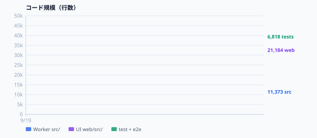
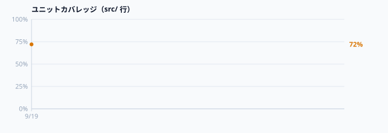

# tossa

[English](README.md) | [日本語](README.ja.md)

> An ultra-lightweight community information platform for sharing and verifying real-time local updates.  
> Seamlessly bridges everyday municipal and commercial updates with emergency crisis communications through an organically emergent vocabulary.  
> Cloudflare-native architecture featuring automated EXIF GPS location pinning, C2PA authenticity verification, hardware-backed E2EE messaging, multi-language internationalization, and decentralized community verification.

[](https://deploy.workers.cloudflare.com/?url=https://github.com/MasKusuno/tossa)

## Codebase health

CI records line counts, test ratio, and unit coverage on every push to `main`. Charts live in [`stats/`](stats/).




Snapshot: [`stats/stats.md`](stats/stats.md)

---

## 🌟 Key Features

1. **Organically Emergent Vocabulary (Tag-Integrated Filtering)**
   - No rigid or pre-imposed categories. Tags posted by citizens and local staff (such as `#water`, `#shelter`, `#cafe`, `#wifi`) are automatically aggregated and ranked by recency and frequency.
   - Eliminates artificial barriers between daily living and emergency modes, autonomously adapting to shifting local needs.

2. **Photo-Driven Posting & EXIF GPS Pinning with Manual Micro-Nudge**
   - Uploading on-site photos extracts GPS latitude and longitude directly from EXIF metadata, pinning the exact location to the map automatically.
   - Expandable map picker (`h-48` to `h-80`), ~10m directional nudge controls, and reverse-geocoded address suggestions for precise pinpointing.
   - Client-side Canvas downscaling (max 1200px / WebP) ensures ultra-fast uploads even over degraded or congested mobile networks.

3. **C2PA Content Authenticity & EXIF Recency Verification**
   - High-speed parsing of embedded JUMBF / C2PA cryptographic manifests proves authenticity against generative AI tampering and photo manipulation.
   - Explicit display of original capture timestamps prevents misleading reuse of outdated disaster imagery.

4. **Hardware-Backed End-to-End Encrypted (E2EE) Secure Messaging**
   - Leverages WebAuthn PRF (Pseudo-Random Function) extension to derive encryption keys directly from biometric authenticators.
   - Facilitates confidential, zero-knowledge inquiries between shelter managers and citizens that cannot be intercepted even by the server host.

5. **Multi-Language, Color Universal Design (CUD) & Web Accessibility (JIS X 8341-3:2016 Level AA / WCAG 2.1/2.2 AA)**
   - Conforms with Japan's Digital Society standards (DS-600 series / Web Accessibility Guidelines) and the Digital Agency Design System.
   - **Color Universal Design (CUD)**: Incorporates explicit symbols (✔/○ Available, ▲ Crowded/Low, ✖/✕ Closed, ? Unknown) and high-contrast borders across all badges and map markers, accommodating color vision deficiency (P/D types) and direct sunlight glare.
   - First-class support for English, standard Japanese, and Plain Japanese ("やさしい日本語", Easy Japanese) for international residents, children, and cognitive accessibility, with dynamic `lang` attribute switching.
   - **Web Speech API Audio Readout**: One-tap text-to-speech voice narration of post titles, locations, statuses, and notes in Japanese and English (for seniors, visually impaired, or listening hands-free while evacuating).
   - **Accessible Font Scaling**: Cycle through Standard (100%), Large (115%), and X-Large (130%) font scale options.
   - Fully keyboard operable, with skip-to-main link, accessible modal focus traps and returns, screen reader live regions, unconstrained pinch-to-zoom, and `prefers-reduced-motion` compliance.

6. **Source Domain Credibility Badging & Community Peer Verification**
   - Automatic classification and trust badges for municipal authorities (`.go.jp`, `.lg.jp`), universities (`.ac.jp`), news agencies, and official SNS channels.
   - Community-powered "Verify on Site" action allows citizens to collaboratively confirm ongoing accuracy and freshness of active posts.

7. **Passkey (WebAuthn) & Seamless Device Cookie Sessions**
   - Immediate friction-free posting without login via secure device cookies.
   - One-tap upgrade to passwordless biometric Passkeys (Touch ID, Face ID, Windows Hello) for persistent role authorization.

8. **Massive Scalability with Zero Egress Cost**
   - Unified Cloudflare Workers + D1 (SQLite) + Workers Static Assets architecture.
   - Aggressive edge caching withstands extreme traffic spikes during large-scale emergencies at near-zero operating costs.

9. **Progressive Web App (PWA) & Offline Disaster Resilience (Outbox Queue Management)**
   - Built-in Service Worker caches the SPA shell and latest community updates.
   - Offline Outbox automatically queues local posts and status reports when connectivity drops, auto-syncing when signal returns.
   - In-app queue inspection, individual item discard, and detailed retry error feedback for pending updates.

10. **Mobile-First Multi-Modal Architecture & Native Bottom Sheets**
    - Seamless layered modal management (non-destructive Passkey auth layering while retaining draft post content).
    - Touch-optimized bottom sheets with drag handles and native browser back button (`popstate`) dismissal.
11. **Dark Mode & High-Contrast Emergency Modes**
    - Dark theme designed for night-time comfort and OLED power-saving during blackouts.
    - High-contrast monochrome mode tailored for readability under harsh outdoor sunlight.
12. **Offline Distance & Compass Direction Indicator with GPS Sorting**
    - 100% offline client-side Haversine straight-line distance (m/km) and forward azimuth bearing calculation.
    - Real-time rotating compass needle tracking device heading (DeviceOrientation API / geomagnetic sensor).
    - Distance-based timeline sorting and interactive user location pin & centering on Leaflet map view.
13. **Offline Evacuation Waypoint Navigation HUD & Compass Tracking**
    - Instant straight-line HUD guidance to selected shelters and water distribution stations.
    - Persistent heads-up display showing live remaining distance countdown, target compass orientation, and 30m proximity arrival alert.
    - Expandable high-contrast compass dial and automatic vector route polyline & waypoint centering on the interactive map.
14. **Offline Post QR Code Display & Peer-to-Peer Import Relay**
    - Display any disaster post as a high-density, high-contrast SVG/PNG QR code containing compact post data.
    - Peer-to-peer scanning via camera (`BarcodeDetector` API with pure-JS `jsQR` fallback) or image/screenshot upload without cellular or Wi-Fi connectivity.
    - Imported posts persist immediately into local offline storage, instantly accessible in timelines, map view, and straight-line Waypoint Navigation HUD.
15. **RFC 8291/8292 Web Push Notifications (VAPID)**
    - Real-time browser push alerts even when the app is closed or in the background, using standards-compliant VAPID signing and AES-128-GCM encrypted payloads — 100% Cloudflare Workers compatible (no Node.js).
    - Auto-broadcast on emergency banner updates, critical disaster posts, and shelter/water status changes; area and alert-type filtering so citizens receive only relevant local events.
16. **Model Context Protocol (MCP) Remote Server (`/mcp`, `/api/mcp`)**
    - Connect AI tools (Claude Desktop, Cursor, Windsurf, Gemini CLI) to tossa via standard Streamable HTTP JSON-RPC 2.0 / SSE to search relief supplies, query shelter occupancy, generate situation briefings, or submit field reports.
    - Protected by Bearer API tokens issued with one click from the Admin Passkey panel. Public endpoints allow safe read-only queries by unauthenticated AI agents.
17. **AI Discovery & Findability (`/llms.txt`, GeoRSS, SSR JSON-LD/OGP)**
    - `/llms.txt`: Concise system briefing and API specifications tailored for LLMs (Perplexity, SearchGPT, Claude, Gemini).
    - `/feed.xml`: GeoRSS (W3C Basic Geo) / RSS 2.0 feed with geographic coordinates for location-aware newsreaders and emergency bots.
    - `/robots.txt`, `/sitemap.xml`: Search engine and web crawler guidance.
    - Dynamic SSR: Cloudflare edge renders rich OGP social meta tags and Schema.org structured data (`DisasterReport`, `Place`, `EmergencyService`).
18. **Offline Map Tile Cache (IndexedDB & Cache API)**
    - Pre-download map tiles for your city or evacuation zones (GSI & OpenStreetMap) into browser storage.
    - Seamlessly inspect map pins, facilities, and routes during total cellular blackout.
19. **Inter-Municipality Disaster Federation Sync (`/api/federation/sync`)**
    - Bidirectional replication between neighboring tossa instances to share emergency relief data across municipal boundaries.
20. **Comprehensive In-App Help & Guides**
    - Instant access via the header "?" icon to citizen guides, offline emergency tools, security & E2EE mechanisms, and one-click copyable MCP configuration JSON.
21. **Multi-Layered Edge Security (Security Headers, Body Limit & Rate Limiting)**
    - Strict Content Security Policy (CSP), `X-Content-Type-Options: nosniff`, and Frame Protection.
    - 2MB request payload size cap and sliding-window edge rate limiters protecting against automated spam and DoS attacks.

---

## 🤖 Model Context Protocol (MCP) & AI Integration

tossa features a native **Model Context Protocol (MCP)** remote endpoint. AI agents can seamlessly interact with community updates and emergency facilities using natural language.

### Claude Desktop Configuration (`claude_desktop_config.json`)

```json
{
  "mcpServers": {
    "tossa": {
      "url": "https://tossa.app/mcp"
    }
  }
}
```

_For authorized operations (such as publishing verified official announcements), issue an API Token from the Admin Panel and specify the Authorization header:_

```json
{
  "mcpServers": {
    "tossa": {
      "url": "https://tossa.app/mcp",
      "headers": {
        "Authorization": "Bearer YOUR_API_TOKEN"
      }
    }
  }
}
```

### Available MCP Tools

- `search_posts`: Search facilities, water stations, shelters, open shops, and community events
- `get_post`: Retrieve full details, community verification count, and status update timeline
- `get_emergency_summary`: Aggregate real-time facility counts and status breakdowns for any area
- `create_post`: Submit new community/disaster posts directly from AI agents
- `update_post_status`: One-tap status updates (available, crowded, low stock, closed)
- `get_categories` / `get_vocabulary_tags` / `get_areas`: Query system taxonomies and dynamic tags

---

## 🔍 AI Discovery & Machine Findability

- **AI Engine Briefing**: [`/llms.txt`](/llms.txt)
- **GeoRSS 2.0 Feed**: [`/feed.xml`](/feed.xml)
- **Sitemap**: [`/sitemap.xml`](/sitemap.xml)
- **Robots Policy**: [`/robots.txt`](/robots.txt)
- **Edge SSR & JSON-LD**: Instant metadata rendering for search engines, LLM scrapers, and SNS previews

---

## 🛠 Tech Stack

- **Runtime & Hosting**: Cloudflare Workers
- **Configuration**: `wrangler.toml` (fully compatible with Deploy to Cloudflare)
- **API Framework**: Hono
- **Database**: Cloudflare D1 (Serverless SQLite)
- **Frontend**: Svelte 5 (Runes) + Vite + Tailwind CSS v4
- **Internationalization (i18n)**: `@inlang/paraglide-js` + Svelte 5 Reactive State
- **Encryption (E2EE)**: Web Crypto API (AES-GCM-256 + ECDH P-256) + WebAuthn PRF
- **Media Processing**: `exifr` (EXIF GPS & Timestamp extraction) + JUMBF/C2PA manifest scanner
- **Authentication**: WebAuthn / Passkeys (`@simplewebauthn/server` & `@simplewebauthn/browser`)
- **Mapping**: Leaflet + GSI Address Search API + OpenStreetMap

---

## 🚀 Local Development Setup

```bash
# 1. Install dependencies
npm install
npm --prefix web install

# 2. Initialize local D1 database schema and seeds
npm run db:reset:local

# 3. Build frontend and start development server (port 8787)
npm run build
npm run dev
```

Open your browser at `http://localhost:8787`.

---

## 🧪 Quality Assurance & Test Suite

The repository includes a comprehensive testing and quality assurance pipeline:

```bash
# 1. Unit and integration tests (Vitest with in-memory D1 SQLite)
npm test

# 2. Browser End-to-End tests (Playwright: multi-language switching, posting, cookie identity, Passkeys)
npm run test:e2e

# 3. Type checking (TypeScript & svelte-check)
npm run typecheck

# 4. Linting (ESLint flat config)
npm run lint
npm run lint:fix

# 5. Code formatting (Prettier)
npm run format:check
npm run format
```

All quality checks are automatically verified on pull requests and pushes to `main` via GitHub Actions CI (`.github/workflows/ci.yml`).  
Pushes to `main` that pass CI are then deployed to Cloudflare Workers (`https://tossa.app`).

### GitHub Actions deploy secrets

Add these repository secrets (Settings → Secrets and variables → Actions):

| Secret | Value |
| --- | --- |
| `CLOUDFLARE_API_TOKEN` | Account API token from [Create Token](https://dash.cloudflare.com/?to=/:account/api-tokens). Start from **Edit Cloudflare Workers**, and include Zone → Workers Routes → Edit for `tossa.app`. |
| `CLOUDFLARE_ACCOUNT_ID` | Account ID from the Cloudflare dashboard Workers overview. |

Do not run `db:seed:remote` from CI. Seed `INSERT OR REPLACE` would overwrite live `system_settings`. Schema and seeds remain a one-time (or manual) operation.

---

## 📦 Production Deployment to Cloudflare

### 1. Create a D1 Database

```bash
npx wrangler d1 create tossa-db
```

Paste the generated `database_id` into your [`wrangler.toml`](./wrangler.toml).  
Configure `RP_ID` and `EXPECTED_ORIGIN` to match your production domain.

### 2. Apply Database Schema & Seeds

```bash
npm run db:init:remote
npm run db:seed:remote
```

### 3. Deploy Application

```bash
npm run deploy
```

---

## 🔒 Sign in with Passkey

1. Open **Passkey** in the top-right header.
2. Enter your name and tap **Continue with Passkey**.
3. Confirm with fingerprint or face ID. No password.
4. The first person to authenticate becomes the administrator.
5. After that, you can set the service area and emergency banner.
